# Module 7 - Profiling & Performance Optimization

## Performance Testing Comparison

Berikut adalah perbandingan hasil pengujian JMeter sebelum dan sesudah dilakukan optimasi kode pada ketiga *endpoint*. Pengujian dilakukan dengan beban 10 *threads* (pengguna).

### 1. Endpoint `/all-student`

Optimasi dilakukan dengan mengatasi *N+1 Query Problem* menggunakan `JOIN FETCH` pada Spring Data JPA.

| Metric             | Before Optimization                                             | After Optimization                                            |
| :----------------- | :-------------------------------------------------------------- | :------------------------------------------------------------ |
| **Result Table**   |      | 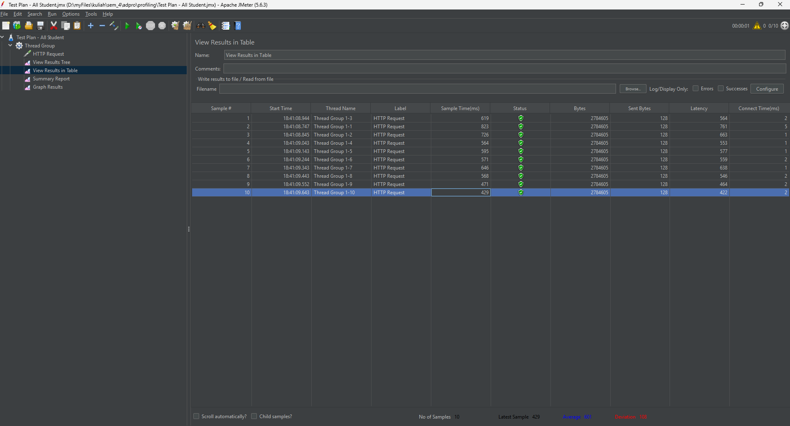     |
| **Result Tree**    | 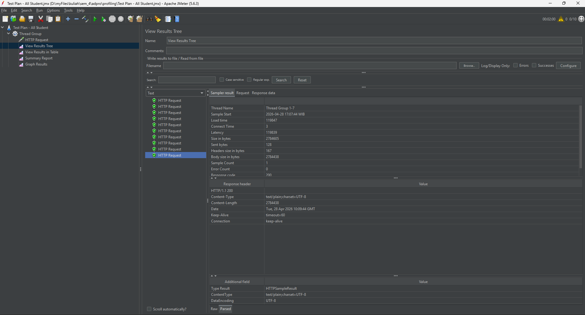       | 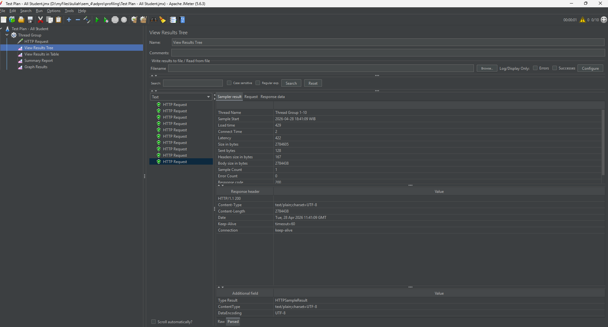       |
| **Summary Report** | 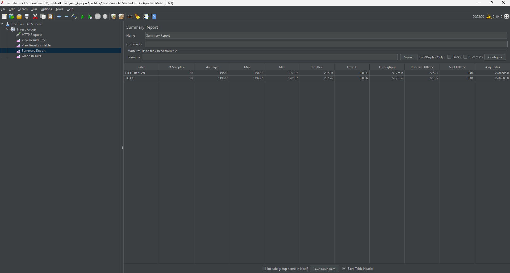 | 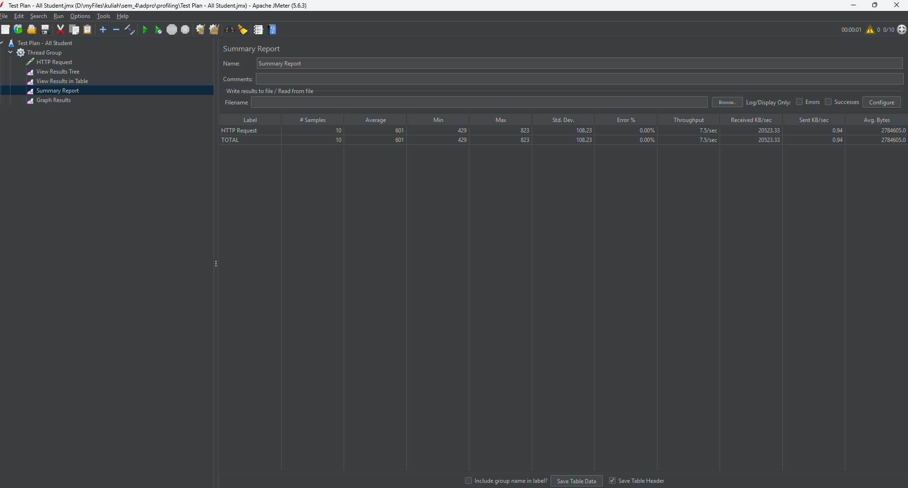 |
| **Graph Result**   | 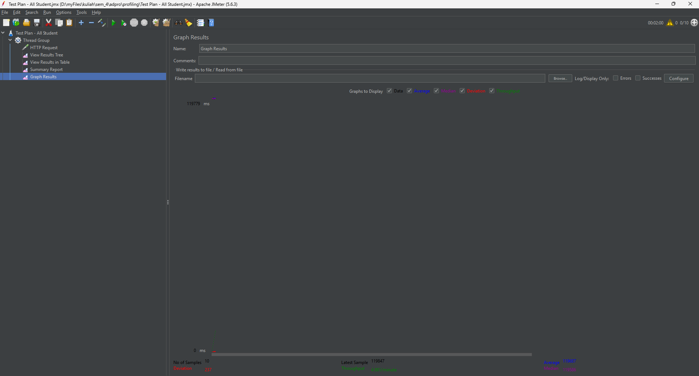     |      |

### 2. Endpoint `/highest-gpa`

Optimasi dilakukan dengan memindahkan beban pencarian IPK tertinggi dari memori aplikasi (Java) ke *database* menggunakan instruksi *sorting* dan *limit* `findTopByOrderByGpaDesc()`.

| Metric             | Before Optimization                                             | After Optimization                                            |
| :----------------- | :-------------------------------------------------------------- | :------------------------------------------------------------ |
| **Result Table**   |      |      |
| **Result Tree**    |        | 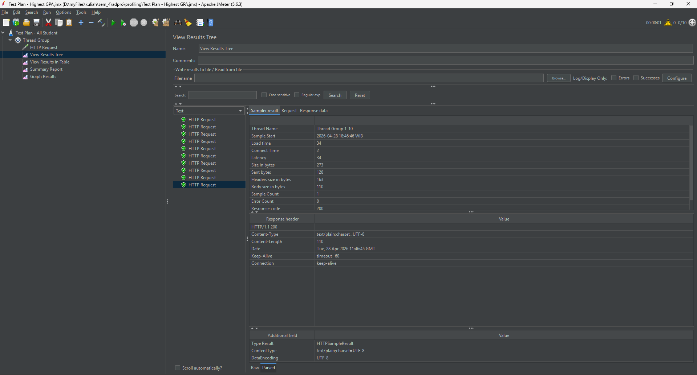       |
| **Summary Report** | 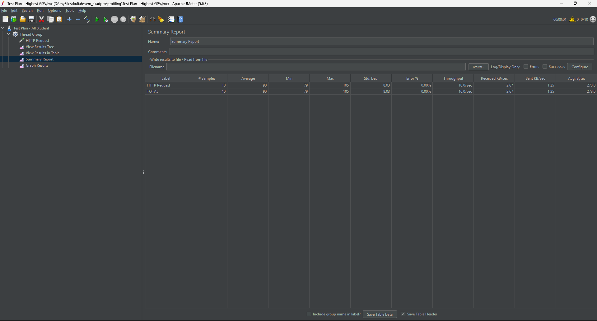 | 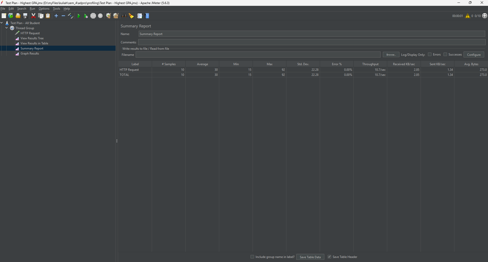 |
| **Graph Result**   |      | 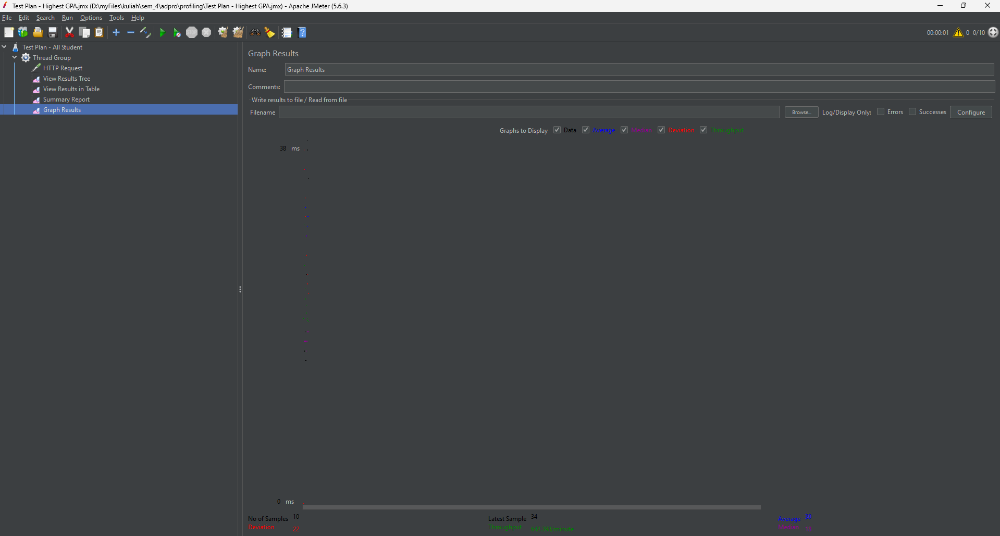     |

### 3. Endpoint `/all-student-name`

Optimasi dilakukan dengan mengimplementasikan *Projection* untuk hanya mengambil kolom nama dari database, dan mengganti konkatensi String (`+=`) di dalam *loop* dengan `String.join()`.

| Metric             | Before Optimization                                                  | After Optimization                                                 |
| :----------------- | :------------------------------------------------------------------- | :----------------------------------------------------------------- |
| **Result Table**   | 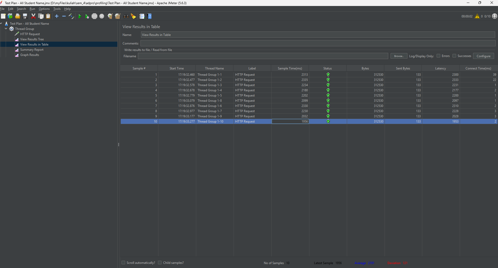     | 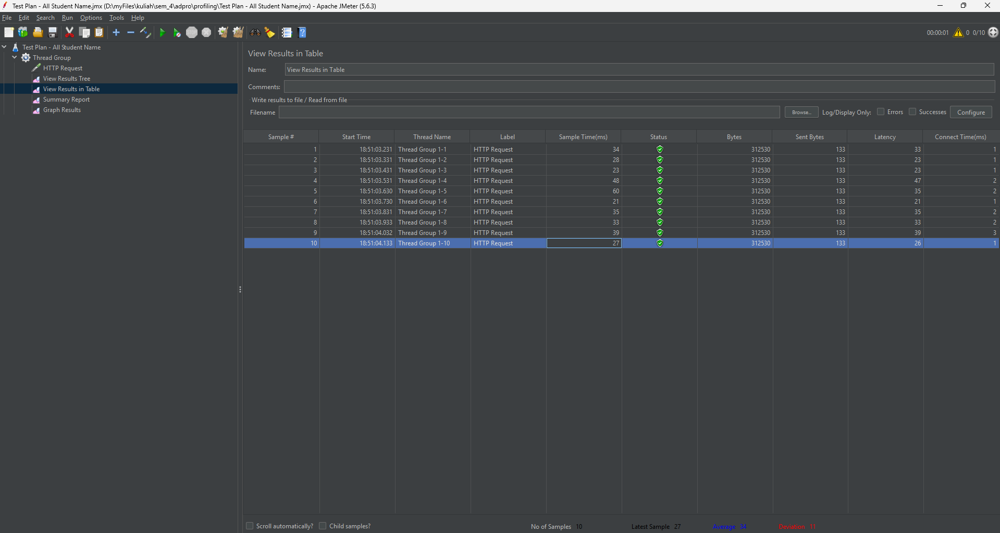     |
| **Result Tree**    | 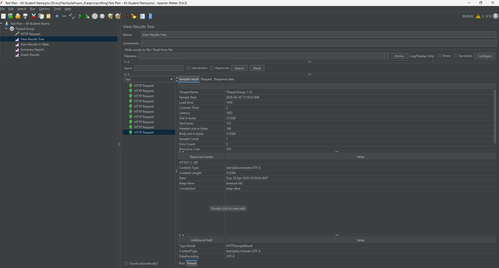       | 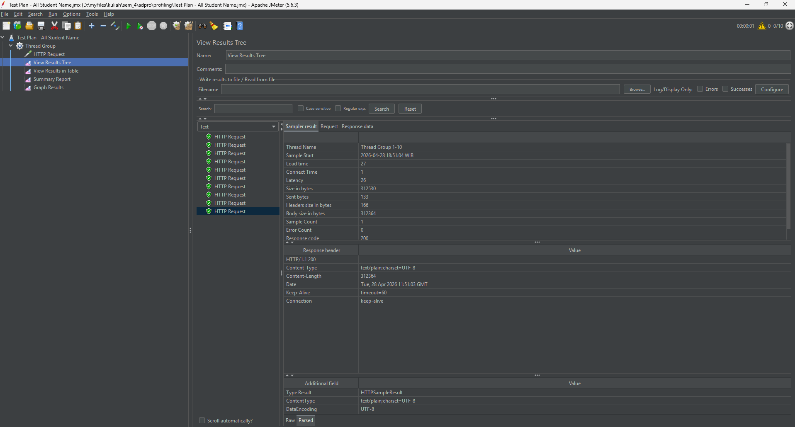       |
| **Summary Report** | 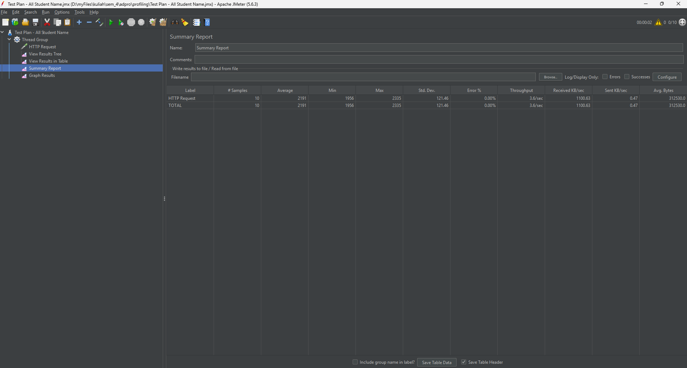 | 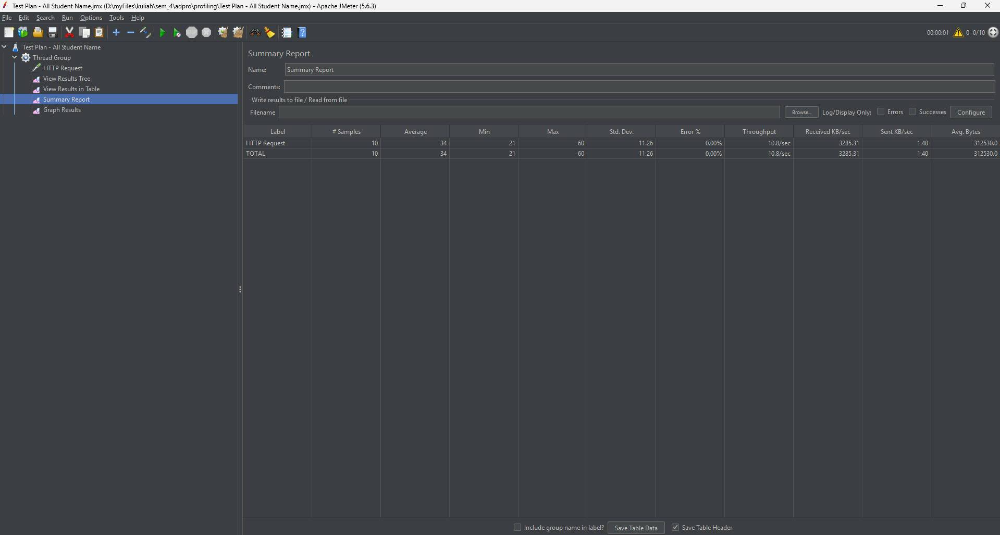 |
| **Graph Result**   |      |      |

---

## Conclusion

Berdasarkan pengujian performa menggunakan JMeter, terdapat peningkatan performa yang sangat signifikan (lebih dari 20%) setelah dilakukan *refactoring* kode.

Sebelum optimasi, aplikasi mengalami kesulitan dalam menangani *request* akibat beban pemrosesan data yang tidak efisien di level memori Java dan *query* berulang ke database. Setelah memindahkan logika penyortiran dan penggabungan (*join*) langsung ke *database* PostgreSQL serta memperbaiki manipulasi tipe data `String`, waktu respons (*Sample Time* / *Latency*) menurun secara drastis, membuktikan bahwa kode telah berjalan jauh lebih optimal.

---

## Reflection

**1. What is the difference between the approach of performance testing with JMeter and profiling with IntelliJ Profiler in the context of optimizing application performance?**

Pendekatan keduanya berbeda pada sudut pandang pengukuran. JMeter beroperasi sebagai alat *black-box/load testing* yang mengukur performa dari sisi eksternal (kacamata pengguna), berfokus pada metrik seperti *response time* dan *throughput* di bawah beban tinggi. Sebaliknya, IntelliJ Profiler adalah alat *white-box/code profiling* yang membedah jalannya aplikasi dari dalam. Profiler menunjukkan secara spesifik *method* atau baris kode mana yang paling banyak mengonsumsi CPU dan memori saat sebuah *request* dieksekusi.

**2. How does the profiling process help you in identifying and understanding the weak points in your application?**

Proses *profiling* membantu menghilangkan tebak-tebakan dalam *debugging*. Melalui visualisasi *flame graph* dan hierarki *call tree*, profiler secara akurat menyoroti *method* yang memakan persentase *CPU time* terbesar. Hal ini langsung mengarahkan fokus pada akar masalah, seperti *looping* yang tidak efisien atau *query* database yang berlebihan.

**3. Do you think IntelliJ Profiler is effective in assisting you to analyze and identify bottlenecks in your application code?**

Sangat efektif. IntelliJ Profiler menyediakan data empiris yang detail dengan memisahkan *total time* dan *CPU time*. Pemisahan ini sangat krusial untuk membedakan apakah lambatnya aplikasi disebabkan oleh beban komputasi instruksi Java murni atau karena waktu tunggu (*waiting/I/O*) saat berinteraksi dengan database.

**4. What are the main challenges you face when conducting performance testing and profiling, and how do you overcome these challenges?**

Tantangan utamanya adalah konsistensi hasil pengujian akibat mekanisme *JIT Compiler* dan *JVM warm-up*. Saat aplikasi baru menyala, *request* pertama umumnya lambat karena JVM belum melakukan optimalisasi *runtime*. Hal ini diatasi dengan memastikan lingkungan pengujian terisolasi dan memberikan pemanasan (*warm-up requests*) ke *endpoint* sebelum mulai merekam sesi *profiler* atau mengambil metrik evaluasi akhir dari JMeter.

**5. What are the main benefits you gain from using IntelliJ Profiler for profiling your application code?**

Manfaat terbesarnya adalah efisiensi waktu dan integrasi alur kerja. Analisis waktu eksekusi kode dapat langsung dilihat melalui *flame graph*, lalu dengan satu klik berpindah ke baris kode yang bermasalah. Proses *data-driven optimization* menjadi jauh lebih cepat tanpa perlu berpindah alat.

**6. How do you handle situations where the results from profiling with IntelliJ Profiler are not entirely consistent with findings from performance testing using JMeter?**

Inkonsistensi adalah hal yang wajar karena metrik pengukurannya berbeda. JMeter mengukur *end-to-end latency* (termasuk *overhead* jaringan dan batas *connection pool*), sedangkan profiler hanya mengukur waktu eksekusi di dalam JVM. Jika terdapat perbedaan, profiler digunakan untuk mengevaluasi efisiensi logika kode (CPU), sementara JMeter tetap menjadi acuan utama untuk performa aplikasi secara nyata.

**7. What strategies do you implement in optimizing application code after analyzing results from performance testing and profiling? How do you ensure the changes you make do not affect the application's functionality?**

Strategi utama adalah mendelegasikan pemrosesan berat ke *database*. Database dirancang untuk efisiensi dalam penyortiran, pemfilteran, dan penggabungan data. Alih-alih menarik seluruh entitas ke memori Java, *query* dioptimalkan menggunakan `JOIN FETCH`, agregasi langsung, dan *projection*. Selain itu, dihindari manipulasi *String* yang tidak efisien dalam *loop*. Untuk menjaga fungsionalitas tetap utuh, dilakukan verifikasi ulang terhadap struktur dan isi *response JSON* melalui REST client setelah *refactoring*, serta idealnya didukung oleh *unit testing* otomatis.
